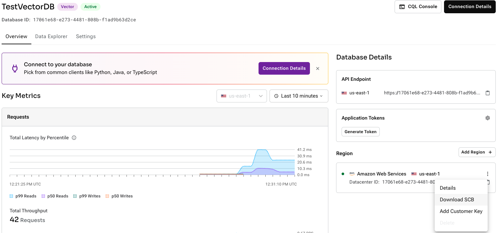
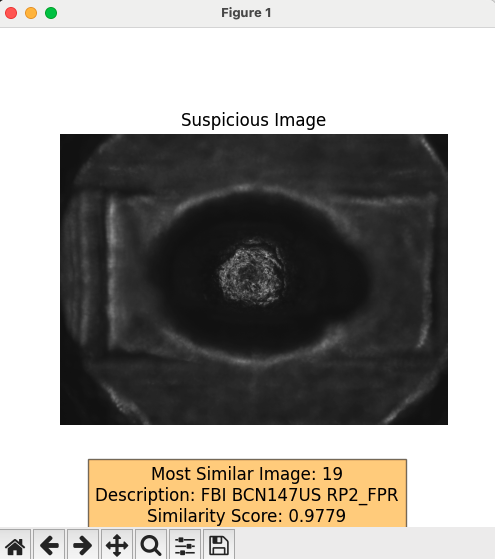

## Functionality
This application leverages the Astra Vector database's capabilities to efficiently store and retrieve high-dimensional vector data, providing a robust solution for managing and querying image content. 

By utilizing SAI (Storage Attached Index, it enhances query performance, particularly for nearest neighbor searches, which are crucial in applications requiring fast and accurate similarity assessments. 

The integration of the CLIP model allows for the encoding of images into meaningful vector representations, enabling the application to understand and process both visual and textual data in a unified manner. 

The use of cosine similarity further aids in quantifying the similarity between vector representations, facilitating the identification of images most similar to a given input. 
This combination of technologies makes the application highly effective for tasks involving image search, comparison, and analysis.

## Prerequisites
This application assumes you have access to:
1. [DataStax Astra DB](https://astra.datastax.com) (you can sign up through your Github account)
2. [OpenAI account](https://platform.openai.com/signup) (you can sign up through your Github account)

### Sign up for Astra DB
Make sure you have a vector-capable Astra database (get one for free at [astra.datastax.com](https://astra.datastax.com))
- You will be asked to provide the **API Endpoint** which can be found in the right pane underneath *Database details*.
- Ensure you have an **Application Token** for your database which can be created in the right pane underneath *Database details*.


### Sign up for OpenAI
- Create an [OpenAI account](https://platform.openai.com/signup) or [sign in](https://platform.openai.com/login).
- Navigate to the [API key page](https://platform.openai.com/account/api-keys) and create a new **Secret Key**, optionally naming the key.

### Download Repository

1. Please visit the GitHub repository at: [Repository](https://github.com/oktytncy/build-rag-chatbot/tree/main)

2. Click <span style="color:green"><> Code</span> and choose one of the method to download files.

3. You can download the ZIP file from the link, or if you have Git installed on your computer, you can use the following command to download it:

    ```git
    git clone https://github.com/oktytncy/image-similarity-search.git
    ```

    For more information on installing Git, please visit the [Installing Git](https://git-scm.com/book/en/v2/Getting-Started-Installing-Git).

### Install Required Packages

```python
pip3 install -r requirements.txt
```

### Connection variables
 
Before we continue, we have to provide the Secure Bundle, ASTRA_DB_TOKEN_BASED_PASSWORD, and clientId.

1. If you’re using a vector Astra DB database, use the following instructions with the secure connect bundle.

    1. Open your Astra Portal and select your database.
    2. On the Overview page, go to Database Details and locate the Region section.
    3. Click the ellipsis (…​), and then select Download secure connect bundle.
    4. Copy or download the secure connect bundle, which is a ZIP file named secure-connect-<database_name>.zip, and copy it to the conf folder with the name secure-connect.zip.

    

2. A token can be generated in the Database Administrator role from the Tokens section on the left side of the DataStax UI. The **clientID** and **secret** from the created token can be copied and pasted into the code.

3. The **ASTRA_DB_KEYSPACE** and **TABLE_NAME** variables can be optionally specified.

### Run application

The application works in two stages.

1. **main.py:** This code is designed to interact with a Cassandra database to store and process image data, using advanced machine learning techniques for embedding generation.

    ```python
    python3 main.py
    ```

1. **findANN.py:** This code is designed to find and display the most similar image to a given **suspicious** image from a set of images stored in a Cassandra database, using cosine similarity as the metric for similarity. Here's a general overview:

    ```python
    python3 findANN.py   
    ```

    